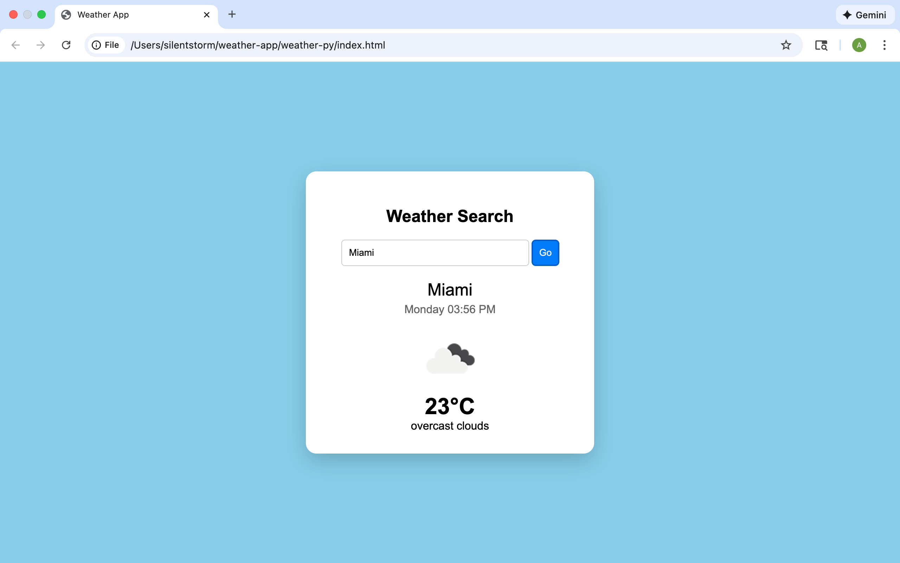

# 🌤️ Modern Weather App

A sleek, responsive weather application built with Vanilla JavaScript and the OpenWeatherMap API.

## ✨ Features
- **Real-time Weather:** Get current temperature and conditions for any city.
- **Glassmorphism UI:** A modern "frosted glass" design.
- **Dynamic Themes:** Icon glows change color based on the temperature (Hot, Moderate, or Cold).
- **Responsive Design:** Works on desktops, tablets, and mobile phones.
- **Smart Search:** Supports the "Enter" key for a faster experience.

## 🛠️ Built With
- **HTML5** - Structure
- **CSS3** - Custom styling and Glassmorphism effects
- **JavaScript (ES6+)** - Fetch API and DOM manipulation
- **OpenWeatherMap API** - Weather data provider

## 📸 Preview

## 🚀 How to Run
1. Clone this repository or download the ZIP.
2. Open `index.html` in your browser.
3. (Optional) Replace the API key in `script.js` with your own from [OpenWeatherMap](https://openweathermap.org/).
